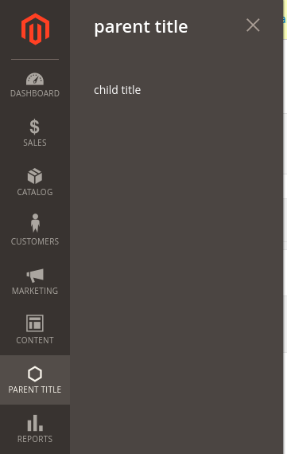
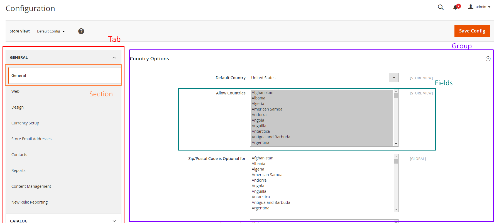
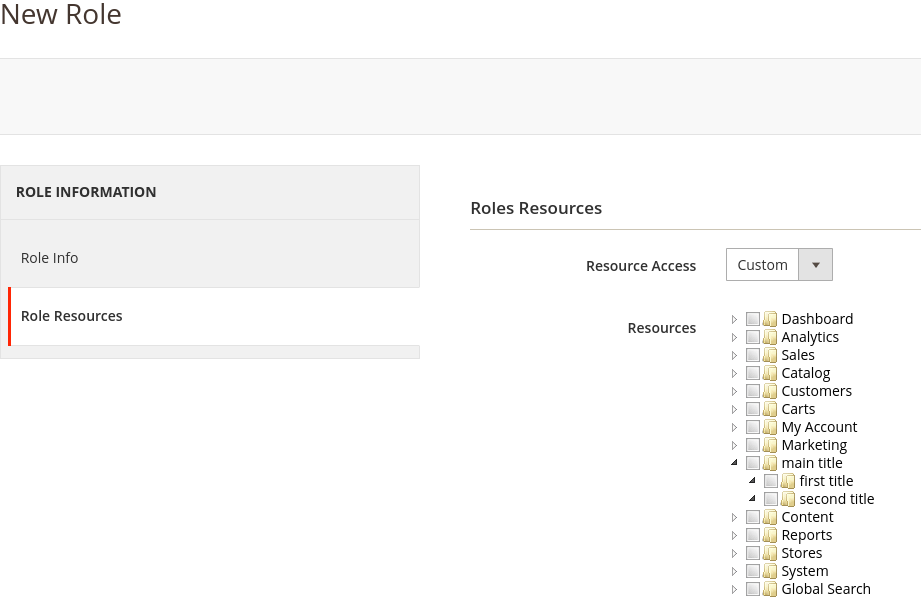

# Документация по программированию на Magento2

## Содержание

1 - [Регистрация модуля](#module-registration)
2 - [Роутинг](#routing)
3 - [MVC](#mvc)

* 3.1 - [Model](#model-in-mvc)
  * 3.1.1 - [Модель ресурсов](#resource-model)
  * 3.1.2 - [Модель](#model)
  * 3.1.3 - [Модель коллекции](#model-collection)
* 3.2 - [View](#view)
  * 3.2.1 - [Макет](#create-layout)
  * 3.2.2 - [Блок](#create-block)
  * 3.2.3 - [Шаблон](#create-template)
  * 3.2.4 - [Админ панель](#admin-panel)
* 3.3 - [Controller](#controller)

4 - [Действия с Базой Данных](#db-actions)

* 4.1 - [Создание таблицы](#db-create-table)
* 4.2 - [Изменение структуры таблицы](#db-edit-table)

5 - [Admin ACL (Access Control Lists - Списки контроля доступа)](#acl)

---

**Корневая директория:** `project_directory/app/code`

### Структура папок

`app/code/Vendor` — название поставщика/разработчика (например: Astrio).
`app/code/Vendor/Module_Name` — название модуля.  
`app/code/Vendor/Module_Name/etc` — содержит файлы конфигурации.

<h2 id="module-registration">1. Регистрация модуля</h2>

### 1.1 Создаем файл `Module_Name/etc/module.xml` с содержимым: {#module-config}

```xml
<?xml version="1.0"?>
<config xmlns:xsi="http://www.w3.org/2001/XMLSchema-instance" xsi:noNamespaceSchemaLocation="urn:magento:framework:Module/etc/module.xsd">
    <module name="Vendor_ModuleName" setup_version="1.0.0"></module>
</config>
```

`name` - это название производителя_название модуля;  
`setup_version` - версия модуля;  

### 1.2 Создаем файл `Module_Name/registration.php` с содержимым

```php
<?php
\Magento\Framework\Component\ComponentRegistrar::register(
    \Magento\Framework\Component\ComponentRegistrar::MODULE,
    'Vendor_ModuleName',
    __DIR__
);
```

> Заменяем Vendor_ModuleName на нужное нам название (название производителя_название модуля).

### 1.3 Запускаем модуль {#run-module}

* Проверяем корректно ли был создан модуль, запускаем команду:  
`php bin/magento module:status`

> Модуль должен быть в списке отключенных модулей

* Включим наш модуль:
`php bin/magento module:enable Vendor_Module`
* Обновим структуры базы данных:
`php bin/magento setup:upgrade`

## 2. Роутинг {#routing}

Cсылка делится на три составных элемента:  
`http://magento2.com/route_name/controller/action`  

`route_name` - название роута ([frontName](#register-route) в **routes.xml**);  
`controller` - папка в каталоге **Controller**;
`action` - php класс с методом **execute**;

### 2.1 Регистрация роута {#register-route}  

#### 2.1.1 Создаем файл `Module_Name/etc/frontend/routes.xml` с содержимым: {#create-route}

```xml
<?xml version="1.0" ?>
<config xmlns:xsi="http://www.w3.org/2001/XMLSchema-instance" xsi:noNamespaceSchemaLocation="urn:magento:framework:App/etc/routes.xsd">
    <router id="standard">
        <route frontName="linkName" id="routeIdName">
            <module name="Vendor_ModuleName"/>
        </route>
    </router>
</config>
```

router `id` -
route `frontName` - название роута в адресной строке;
route `id` - идентификатор роута(применяется в [шаблоне](#create-layout));
module `name` - название модуля;

## 3. MVC {#mvc}

### 3.1 Model {#model-in-mvc}

В Magento2 модель разделена на три части, это:

* **ResourceModel** - для совершения действий с базой данных (CRUD);
* **Model** - содержит бизнес-логику модели;
* **Collection** - для фильтрования и сортировки данных модели;

#### 3.1.1 Создадим модель ресурсов в `ModuleName/Model/ResourceModel/ResourceModelName.php` с содержимым: {#resource-model}

```php
<?php

namespace Vendor\ModuleName\Model\ResourceModel;

class ResourceModelName extends \Magento\Framework\Model\ResourceModel\Db\AbstractDb
{
 
 public function __construct(
  \Magento\Framework\Model\ResourceModel\Db\Context $context
 )
 {
  parent::__construct($context);
 }
 
 protected function _construct()
 {
  $this->_init('vendor_modulename_tablename', 'pk_id');
 }
 
}
```

> Все фактические операции с базой данных выполняются моделью ресурсов. Каждая модель должна иметь модель ресурсов.

#### 3.1.2 Создадим модель в `ModuleName/Model/ModelName.php` с содержимым: {#model}

```php
<?php

namespace Vendor\ModuleName\Model;

class ModelName extends \Magento\Framework\Model\AbstractModel implements \Magento\Framework\DataObject\IdentityInterface
{
 const CACHE_TAG = 'vendor_modulename_tablename';

 protected $_cacheTag = 'vendor_modulename_tablename';

 protected $_eventPrefix = 'vendor_modulename_tablename';

 protected function _construct()
 {
  $this->_init('Vendor\ModuleName\Model\ResourceModel\ResourceModelName');
 }

 public function getIdentities()
 {
  return [self::CACHE_TAG . '_' . $this->getId()];
 }

 public function getDefaultValues()
 {
  $values = [];

  return $values;
 }
}
```

> метод _init() определяет [модель ресурсов](#resource-model), которая фактически будет извлекать информацию из базы данных.

#### 3.1.3 Создадим модель коллекции в `ModuleName/Model/ResourceModel/ModelName/Collection.php` с содержимым {#model-collection}

```php
<?php

namespace Vendor\ModuleName\Model\ResourceModel\ModelName;

class Collection extends \Magento\Framework\Model\ResourceModel\Db\Collection\AbstractCollection
{
 protected $_idFieldName = 'pk_id';
 protected $_eventPrefix = 'vendor_modulename_tablename_collection';
 protected $_eventObject = 'modelname_collection';

 /**
  * Define resource model
  *
  * @return void
  */
 protected function _construct()
 {
  $this->_init('Vendor\ModuleName\Model\ModelName', 'Vendor\ModuleName\Model\ResourceModel\ResourceModelName');
 }

}
```

> метод _init() определяет [модель](#model) и [модель ресурсов](#resource-model)

### 3.2 View {#view}

Состоит из трех компонентов (подробнее [здесь](https://devdocs.magento.com/guides/v2.3/frontend-dev-guide/layouts/layout-overview.html))

* Layouts - описывает структуру веб-страницы;
* Containers - секции для заполнения контентом;
* Blocks - элементы пользовательского интерфейса на странице.

#### 3.2.1 Создадим макет страницы в `ModuleName/view/area/layout/helloworld_index_index.xml` с содержимым: {#create-layout}

> структура расположения макета `module_name`/view/`area`/layout, где:
>
> * `area` - может быть **frontend**(область пользователя) или **adminhtml**(область админ панели);  

> название макетa состоит из `routerId`_`controllerName`_layoutName.xml, где:
>
> * `routerId` - [id](#create-route) роута;

```xml
<?xml version="1.0"?>
<page xmlns:xsi="http://www.w3.org/2001/XMLSchema-instance" layout="1column" xsi:noNamespaceSchemaLocation="urn:magento:framework:View/Layout/etc/page_configuration.xsd">
    <referenceContainer name="content">
        <block class="Vendor\ModuleName\Block\BlockName" name="moduleName_blockName" template="Vendor_ModuleName::templateName.phtml" />
    </referenceContainer>
</page>
```

> block `class` - путь к классу [блока](#create-block);  
> block `name` - идентификатор блока;  
> block `template` - название [шаблона](#create-template);

#### 3.2.2 Создадим блок файл в `ModuleName/Block/BlockName.php` с содержимым: {#create-block}

```php
<?php

namespace Vendor\ModuleName\Block;

class BlockName extends \Magento\Framework\View\Element\Template
{
 protected $_modelnameFactory;

 public function __construct(
  \Magento\Framework\View\Element\Template\Context $context,
  \Vendor\ModuleName\Model\ModelNameFactory $modelnameFactory
 ) {
  $this->_modelnameFactory = $modelnameFactory;
  parent::__construct($context);
 }

 public function getModelCollection()
 {
  $modelData = $this->_modelnameFactory->create();
  return $modelData->getCollection();
 }
}
```

#### 3.2.3 Создадим файл шаблона в `ModuleName/view/area/templates/templateName.phtml` с содержимым: {#create-template}

```php
<ul>
 <?php
  foreach ($block->getModelCollection() as $key=>$item){
   echo $item;
  }
 ?>
</ul>
```

 > $block - переменная для использования данных с класса [блока](#create-block);

#### 3.2.4 Админ панель {#admin-panel}

##### 3.2.4.1 Меню {#admin-view-menu}

создадим `ModuleName/etc/adminhtml/menu.xml` с содержимым:

```xml
<?xml version="1.0"?>
<config xmlns:xsi="http://www.w3.org/2001/XMLSchema-instance" xsi:noNamespaceSchemaLocation="urn:magento:module:Magento_Backend:etc/menu.xsd">
    <menu>
        <add id="Vendor_ModuleName::parentId" title="parent title" module="Vendor_ModuleName" sortOrder="51" resource="Vendor_ModuleName::aclFirstRule"/>
        <add id="Vendor_ModuleName::post" title="child title" module="Vendor_ModuleName" sortOrder="10" action="vendor_moduleName/post" resource="Vendor_ModuleName::aclSecondRule" parent="Vendor_ModuleName::parentId"/>
    </menu>
</config>
```

> id — идентификатор меню (в формате: {Vendor_ModuleName}::{menu_description});
title — это текст, который будет отображаться в строке меню;  
module — определяет модуль, которому принадлежит это меню;  
sortOrder — определяет положение меню. Нижнее значение будет отображаться в верхней части меню;  
parent — привязка к родительскому меню по его id;  
action — определять URL-адрес страницы, на которую ссылается это меню.  
resource — [правила доступа](#acl) (в формате: {Vendor_ModuleName}::{rule});

<figure>
 
</figure>

##### 3.2.4.2 Конфигурации {#admin-view-configuration}

<figure>
 
</figure>

создадим `ModuleName/etc/adminhtml/system.xml` с содержимым:

```xml
<?xml version="1.0"?>
<config xmlns:xsi="http://www.w3.org/2001/XMLSchema-instance" xsi:noNamespaceSchemaLocation="urn:magento:module:Magento_Config:etc/system_file.xsd">
    <system>
        <tab id="tabId" translate="label" sortOrder="10">
            <label>Tab Name</label>
        </tab>
        <section id="sectionId" translate="label" sortOrder="130" showInDefault="1" showInWebsite="1" showInStore="1">
            <class>separator-top</class>
            <label>Section Name</label>
            <tab>tabId</tab>
            <resource>Vendor_ModuleName::aclRule</resource>
            <group id="groupId" translate="label" type="text" sortOrder="10" showInDefault="1" showInWebsite="0" showInStore="0">
                <label>Group Name</label>
                <field id="fieldId" translate="label" type="select" sortOrder="1" showInDefault="1" showInWebsite="0" showInStore="0">
                    <label>field title</label>
                    <source_model>Magento\Config\Model\Config\Source\Yesno</source_model>
                </field>
                <field id="fieldId2" translate="label" type="text" sortOrder="1" showInDefault="1" showInWebsite="0" showInStore="0">
                    <label>field title</label>
                    <comment>This text will display on the frontend.</comment>
                </field>
            </group>
        </section>
    </system>
</config>
```

**Теги:**
> class - это значение будет добавлено как класс этого элемента;  
resource - [права](#acl) которые должен иметь пользователь;

**Атрибуты:**
> `id` - идентификатор  элемента;  
`translate` - какой элемент нужно перевести;  
`sortOrder` - сортировка;  
`showInDefault/showInWebsite/showInStore` - будет ли этот элемент отображаться в каждой области видимости или нет;  
`type` - аналогичный тип в **input** (text, number, ...);

**Установить значение по умолчанию:**

создадим файл конфигурации `ModuleName/etc/config.xml` с содержимым:

```xml
<?xml version="1.0"?>
<config xmlns:xsi="http://www.w3.org/2001/XMLSchema-instance" xsi:noNamespaceSchemaLocation="urn:magento:module:Magento_Store:etc/config.xsd">
    <default>
        <sectionId>
            <groupId>
                <fieldId>1</fieldId>
                <fieldId2>Hello World</fieldId2>
            </groupId>
        </sectionId>
    </default>
</config>
```

**Получить значения конфигурации:**

```php
$this->scopeConfig->getValue('sectionId/groupId/fieldId', \Magento\Store\Model\ScopeInterface::SCOPE_STORE);
```

### 3.3 Controller {#controller}

#### 3.3.1 Создадим контроллер `ModuleName/Controller/ControllerName/Action.php` с содержимым {#create-controller}

```php
<?php

namespace Vendor\ModuleName\Controller\ControllerName;

class Action extends \Magento\Framework\App\Action\Action
{
    protected $_pageFactory; //для шаблона
 protected $_modelnameFactory; //для модели

    public function __construct(
        \Magento\Framework\App\Action\Context $context,
        \Magento\Framework\View\Result\PageFactory $pageFactory,
  \Vendor\ModuleName\Model\ModelNameFactory $modelnameFactory
    ) {
        $this->_pageFactory = $pageFactory;
  $this->_modelnameFactory = $modelnameFactory;
        return parent::__construct($context);
    }

    public function execute()
    {
        //ваш код

        //для модели
        //$modelData = $this->_modelnameFactory->create();
        //$collection = $modelData->getCollection();

        //return $this->_pageFactory->create(); //для шаблона (view)
    }
}
```

## 4. Действия с Базой Данных {#db-actions}

### 4.1 Создание таблицы {#db-create-table}

* В файле `ModuleName/Setup/InstallSchema.php` распишем структуру таблицы:

```php
<?php
namespace Vendor\ModuleName\Setup;

class InstallSchema implements \Magento\Framework\Setup\InstallSchemaInterface
{

 public function install(\Magento\Framework\Setup\SchemaSetupInterface $setup, \Magento\Framework\Setup\ModuleContextInterface $context)
 {
  $installer = $setup;
  $installer->startSetup();
  if (!$installer->tableExists('vendor_modulename_tablename')) {
   $table = $installer->getConnection()->newTable(
    $installer->getTable('vendor_modulename_tablename')
   )
    ->addColumn(
     'pk_id',
     \Magento\Framework\DB\Ddl\Table::TYPE_INTEGER,
     null,
     [
      'identity' => true,
      'nullable' => false,
      'primary'  => true,
      'unsigned' => true,
     ],
     'PK ID'
    )
                ->addColumn(
     'name',
     \Magento\Framework\DB\Ddl\Table::TYPE_TEXT,
     255,
     ['nullable => false'],
     'Name'
    );

   $installer->getConnection()->createTable($table);
  }

  $installer->endSetup();
 }
}
```

### 4.2 Изменение структуры таблицы {#db-edit-table}

* В файле `ModuleName/Setup/UpgradeSchema.php` распишем структуру таблицы:

```php
<?php
namespace Vendor\ModuleName\Setup;

use Magento\Framework\Setup\UpgradeSchemaInterface;
use Magento\Framework\Setup\SchemaSetupInterface;
use Magento\Framework\Setup\ModuleContextInterface;

class UpgradeSchema implements UpgradeSchemaInterface
{
 public function upgrade( SchemaSetupInterface $setup, ModuleContextInterface $context ) {
  $installer = $setup;

  $installer->startSetup();

  if(version_compare($context->getVersion(), '1.1.0', '<')) {
   if (!$installer->tableExists('vendor_modulename_tablename')) {
    $table = $installer->getConnection()->newTable(
     $installer->getTable('vendor_modulename_tablename')
    )
     ->addColumn(
      'pk_id',
      \Magento\Framework\DB\Ddl\Table::TYPE_INTEGER,
      null,
      [
       'identity' => true,
       'nullable' => false,
       'primary'  => true,
       'unsigned' => true,
      ],
      'PK ID'
     )
     ->addColumn(
      'name',
      \Magento\Framework\DB\Ddl\Table::TYPE_TEXT,
      255,
      ['nullable => false'],
      'Name'
     );

    $installer->getConnection()->createTable($table);
   }
  }

  $installer->endSetup();
 }
}
```

> тут идет сравнение c прошлой [версией модуля](#module-config)

> При каждом обновлений структуры базы данных нужно запускать команду `php bin/magento setup:upgrade`

## 5. Admin ACL (Access Control Lists - Списки контроля доступа) {#acl}

### 5.1 создадим `ModuleName/etc/acl.xml` с содержимым

```xml
<?xml version="1.0"?>
<config xmlns:xsi="http://www.w3.org/2001/XMLSchema-instance" xsi:noNamespaceSchemaLocation="urn:magento:framework:Acl/etc/acl.xsd">
    <acl>
        <resources>
            <resource id="Magento_Backend::admin">
                <resource id="Vendor_ModuleName::aclId" title="main title" sortOrder="51">
                    <resource id="Vendor_ModuleName::aclFirstRule" title="first title" sortOrder="10"/>
                    <resource id="Vendor_ModuleName::aclSecondRule" title="second title" sortOrder="99" />
                </resource>
            </resource>
        </resources>
    </acl>
</config>
```

<figure>
 
</figure>
